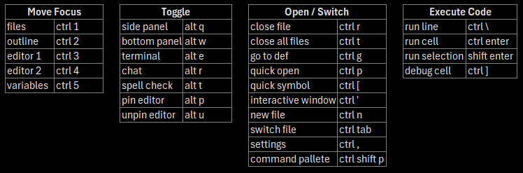

## Keybindings

Remove ctrl + ` binding in Conemu: https://github.com/Microsoft/vscode/issues/23635

## Extensioms

longfish801.regexpoutline
ms-python.debugpy        
ms-python.python
ms-python.vscode-pylance
ms-toolsai.datawrangler
ms-toolsai.datawrangler
ms-toolsai.jupyter
ms-toolsai.jupyter-keymap
ms-toolsai.jupyter-renderers
ms-toolsai.vscode-jupyter-cell-tags
ms-toolsai.vscode-jupyter-slideshow
mutantdino.resourcemonitor
streetsidesoftware.code-spell-checker
